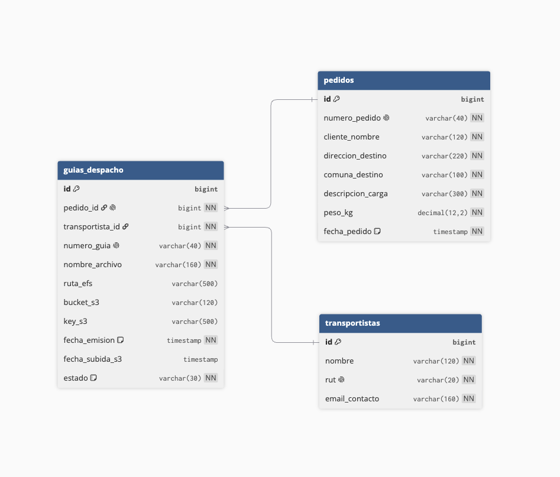

# Guias Despacho Service

Microservicio Spring Boot para un Sistema de Gestion de Pedidos y Generacion de Guias de Despacho. Mantiene el stack de `CloudNativeS1`: Java 21, Spring Boot, Maven, H2/JPA, AWS SDK S3, Docker y GitHub Actions.

## Funcionalidades

- Generacion de guias de despacho en formato TXT.
- Almacenamiento temporal en EFS/local.
- Subida de guias a AWS S3.
- Organizacion de archivos por fecha y transportista.
- Descarga desde S3 con validacion de permisos por transportista.
- Modificacion, reemplazo y eliminacion de guias.
- Consulta de historial por transportista y fecha.
- Pipeline con Docker Hub, GitHub Actions y despliegue en EC2.

## Ejecutar localmente

Configurar variables de entorno:

```bash
export AWS_REGION=us-east-1
export AWS_S3_GUIAS_BUCKET=nombre-del-bucket
export GUIAS_EFS_DIR=./efs
export AWS_ACCESS_KEY_ID=tu-access-key-id
export AWS_SECRET_ACCESS_KEY=tu-secret-access-key
export AWS_SESSION_TOKEN=tu-session-token
```

Iniciar la aplicacion:

```bash
mvn spring-boot:run
```

La API queda disponible en `http://localhost:8080`.

La consola H2 queda disponible en `http://localhost:8080/h2-console`.

- JDBC URL: `jdbc:h2:file:./data/guias-despacho-db`
- User: `sa`
- Password: dejar vacio

Las guias generadas se guardan temporalmente en EFS/local y luego pueden subirse a S3 con una key organizada por fecha y transportista:

```text
yyyyMMdd/transportista/guia-1.txt
```

Ejemplo de archivo local:

```text
efs/20260607/transportes-cordillera/guia-1.txt
```

## Base De Datos

El esquema SQL esta en:

```text
src/main/resources/schema.sql
```

Tambien se incluye el modelo en DBML:

```text
docs/schema.dbml
```

Diagrama del modelo:



Tablas principales:

- `transportistas`
- `pedidos`
- `guias_despacho`

## Endpoints

### Transportistas

```http
GET /api/transportistas
```

```http
POST /api/transportistas
Content-Type: application/json

{
  "nombre": "Transportes Andes",
  "rut": "76000001-1",
  "emailContacto": "operaciones@transportesandes.cl"
}
```

### Crear guia de despacho

```http
POST /api/guias
Content-Type: application/json

{
  "numeroPedido": "PED-1001",
  "clienteNombre": "Comercial Norte",
  "direccionDestino": "Av. Siempre Viva 123",
  "comunaDestino": "Santiago",
  "descripcionCarga": "10 cajas de repuestos",
  "pesoKg": 125.5,
  "transportistaId": 1
}
```

La guia se genera como TXT y se guarda temporalmente en el directorio configurado como EFS.

### Subir guia generada a S3

```http
POST /api/guias/1/s3
```

### Descargar guia desde S3 con validacion de permisos

```http
GET /api/guias/1/s3?transportistaId=1
```

Si el `transportistaId` no corresponde a la guia, la API responde `403`.

### Modificar guia

```http
PUT /api/guias/1
Content-Type: application/json

{
  "numeroPedido": "PED-1001",
  "clienteNombre": "Comercial Norte",
  "direccionDestino": "Av. Nueva 456",
  "comunaDestino": "Providencia",
  "descripcionCarga": "10 cajas de repuestos y accesorios",
  "pesoKg": 130,
  "transportistaId": 2
}
```

### Reemplazar archivo de guia en S3

```http
PUT /api/guias/1/s3
Content-Type: multipart/form-data

file=@guia-corregida.txt
```

### Eliminar guia especifica

```http
DELETE /api/guias/1
```

### Consultar guias por transportista y fecha

```http
GET /api/guias?transportistaId=1&fecha=2026-06-06
```

## Despliegue con GitHub Actions

El workflow `.github/workflows/main.yml` compila el proyecto, ejecuta pruebas, publica la imagen en Docker Hub y despliega el contenedor en EC2 por SSH.

Secrets requeridos:

| Secret | Uso |
| --- | --- |
| `DOCKERHUB_USERNAME` | Usuario de Docker Hub. |
| `DOCKERHUB_TOKEN` | Token de Docker Hub. |
| `EC2_HOST` | Host publico o IP publica de EC2. |
| `EC2_SSH_KEY` | Llave privada SSH. |
| `USER_SERVER` | Usuario SSH de EC2. |
| `AWS_ACCESS_KEY_ID` | Access key usada por el contenedor. |
| `AWS_SECRET_ACCESS_KEY` | Secret key usada por el contenedor. |
| `AWS_SESSION_TOKEN` | Token temporal, si corresponde. |
| `AWS_S3_GUIAS_BUCKET` | Bucket donde se guardan las guias. |

